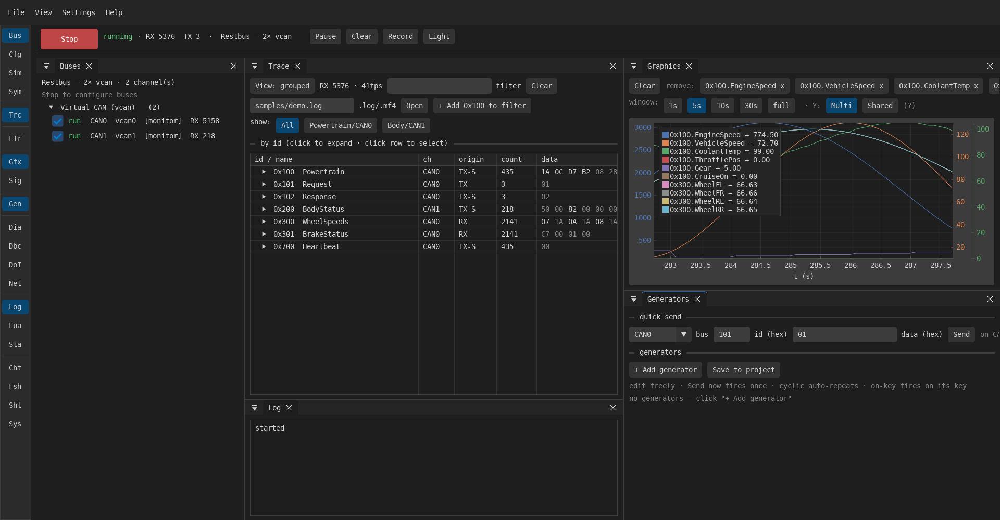
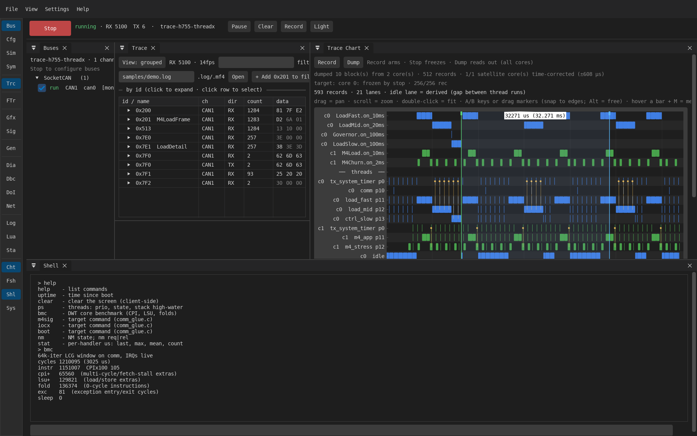

# Blobly Net

An automotive bus tester written in [V](https://vlang.io). It exercises a System Under
Test (SUT) over **CAN**, and over **Ethernet** using the automotive protocols that run on it
(**DoIP**, **SOME/IP**) — send and observe traffic, run diagnostics, script test cases,
simulate ECUs, and read back logs — **virtual first** (Linux `vcan0`), with real hardware as
a drop-in.

**Two ways to drive it, over the same engine:** the **GUI** for interactive work, and
**[headless](#headless--scripted-no-gui)** — Lua test scripts and CLI tools with no window and
no display, which is how it runs in CI. The protocol engine lives in `modules/` and imports no
GUI code, so neither mode is a second-class path.

> Early WIP, but broadly usable. Architecture and decisions are in [CLAUDE.md](CLAUDE.md);
> what's coming is in [ROADMAP.md](ROADMAP.md); the archived development log is in
> [docs/history.md](docs/history.md).



*The `sim-demo` project running with no hardware: two in-process CAN networks with simulated
ECUs, the grouped trace (decoded via DBC), and live multi-axis plots of `EngineSpeed`,
`VehicleSpeed` and `ThrottlePos`.*

## Get it

There is **no tagged release yet** — nothing to download from a Releases page.

**Windows** — CI builds a self-contained bundle on every push to `main`. Take it from
**[Actions](../../actions/workflows/windows.yml)** → the latest `windows-build` run →
the **`blobly_vgui-mingw-x64`** artifact. Unzip and run `blobly_vgui.exe`: the runtime DLLs,
the demo projects, DBCs and sample logs are all bundled, so it runs on a clean machine with
nothing installed. Two caveats — downloading an artifact requires being signed in to GitHub,
and artifacts expire (~90 days), so use a recent run.

**Linux / WSL2** — build from source; it's two commands, see
[Build & run](#build--run) below.

**macOS** — not built or tested.

## What it does

**Buses**
- **CAN / CAN-FD** — see the hardware/OS matrix below
  - software buses for driver-free tests: in-process (`inproc:`) and UDP multicast
- **Ethernet** — **DoIP** (UDS over TCP) and **SOME/IP** (incl. an RPC client), over ordinary
  TCP/UDP sockets. Automotive *PHYs* (100BASE-T1 and similar) and TSN are out of scope.
- LIN is on the roadmap, not implemented yet

### CAN hardware — and why the same adapter is named differently per OS

The **same physical adapter** is reached through a **different software stack** depending on where
Blobly Net runs, so the interface string differs too:

| | Linux / **WSL2** | native Windows |
|---|---|---|
| **PEAK PCAN** | ✅ kernel `peak_usb` → SocketCAN `can0` | ✅ PCAN-Basic DLL → `pcan:PCAN_USBBUS1@500000` |
| **Kvaser** | ✅ kernel `kvaser_usb` → SocketCAN `can0` | ✅ CANlib DLL → `kvaser:0@500000` |
| **Vector** (VN16xx…) | ❌ no mainline driver | ❌ no backend here (vendor XL SDK exists) |
| CAN-FD | PCAN ✅ · Kvaser Leaf Light v2 is classic-only | PCAN ✅ |

- **On Linux and WSL2** the *kernel* owns the adapter and presents it as a **SocketCAN netdev**
  (`can0`), so Blobly Net just uses SocketCAN — no vendor SDK involved.
- **On native Windows** there is no SocketCAN, so the adapter is reached through the **vendor's
  userspace DLL**, loaded at runtime (no SDK to build against; you do need the vendor driver).
- **WSL2 needs one extra step:** USB isn't exposed by default, so attach the adapter with
  `usbipd-win` first — `scripts/usbip.sh attach <busid>` — after which the kernel driver creates
  `can0` exactly as on native Linux.

Full detail, including the WSL kernel requirements:
[can_hardware.md](docs/can_hardware.md) · [windows_can_hardware.md](docs/windows_can_hardware.md).

**Diagnostics** — **UDS** over **ISO-TP** (ISO 15765-2), plus a **flashing** tool that
drives a UDS firmware-download session against a [blobly_emb](docs/blobly_emb_synergies.md)
bootloader.

**Databases & signals** — a native **DBC** parser (`candb`) with a **DBC editor** in the
GUI: decode/encode signals, value tables, multiplexing, and a canonical writer so a
save/load cycle never drifts a file (git diffs show real changes only).

**Simulation** — simulated ECUs that send and answer frames, so tests need no hardware.

**Logs & replay** — `candump -l` files, native **ASAM MDF4** (`.mf4`) reading, and **replay**
of a recording at its original cadence.

**Observability** — a **trace/telemetry** view of a running SUT (handler and thread
swimlanes, CPU load), and a read-only **System** panel showing the modelled network.



*A dual-core **STM32H755** traced live over SocketCAN. Handler lanes on top (`c0` = the CM7's
`LoadFast`/`LoadMid`/`Governor`/`LoadSlow`, `c1` = the CM4's `M4Load`/`M4Churn`), RTOS thread
lanes below with their priorities, a derived idle lane, and preemption cut-links joining a
preempted thread to what displaced it. Both cores share **one** timeline: each stamps records
from its own free-running clock, so the target measures the offset per dump and the header
reports it —* `1/1 satellite core(s) time-corrected (±608 µs)` *— rather than silently implying
the lanes are comparable. Below, the **Shell** panel talks to the target over CAN (`bmc` is an
on-target DWT benchmark: cycles, CPI, stalls).*

> ### ⚠ This screenshot needs the other half — which isn't released yet
>
> The **trace swimlane**, **Shell**, **Flash** and **System** panels don't test an arbitrary
> ECU: they speak wire formats implemented by
> [**blobly_emb**](docs/blobly_emb_synergies.md), the companion embedded stack that runs on the
> target. They are the group at the bottom of the activity bar (`Cht`/`Fsh`/`Shl`/`Sys`),
> deliberately separated there for this reason.
>
> **blobly_emb is not publicly released yet**, so today those four panels have nothing to talk
> to. Everything else on this page — CAN and CAN-FD, DBC decode/encode and the editor, ISO-TP,
> UDS, DoIP, SOME/IP, simulated ECUs, logs, replay and Lua scripting — is standalone and works
> against any target, or against no hardware at all.

**Scripting** — **Lua** test scripts with a small test framework, runnable headless in
CI or live in the GUI.

The GUI is a native **Dear ImGui + ImPlot** application (`cmd/blobly_vgui`); everything it
shows is also reachable without it — see [headless](#headless--scripted-no-gui) below.

## Build & run

```sh
scripts/setup_env.sh           # installs toolchain + deps (V, C/C++, GLFW, FreeType)
scripts/run_vgui.sh            # build + run the GUI
python3 sut/can_sut.py vcan0   # a virtual ECU on vcan0, in another terminal
```

To reproduce the screenshot above — no hardware, no drivers:

```sh
BLOBLY_PROJECT=projects/sim-demo.blobnet BLOBLY_AUTOSTART=1 scripts/run_vgui.sh
```

Needs the V compiler, a C/C++ toolchain, and GLFW + FreeType (on Debian/Ubuntu:
`sudo apt install libglfw3-dev libfreetype-dev`). See
[windows_build.md](docs/windows_build.md) for the native Windows recipe.

## Headless / scripted (no GUI)

The engine is GUI-free by design, so the whole tool runs without a window — no display, no
GLFW, nothing to click. This is how it runs in CI.

**Lua test scripts** (diagnostics, raw frames, DBC signals) against a simulated bus and ECU.
No hardware, no display; non-zero exit if any test fails:

```sh
scripts/runtests.sh tests/diag_basic.lua tests/bus_signals.lua
# => 10 passed, 0 failed, 0 script error(s)
```

Point it at a different project with `--project projects/<name>.blobnet`. The full Lua API is
in the **[scripting & test guide](docs/scripting.md)**.

**CLI tools** — each runs standalone via
`v -enable-globals -path "@vlib|@vmodules|modules" run cmd/<tool>/<file>.v`:

| tool | what | |
|---|---|---|
| `flash` | drive a UDS firmware download against a blobly_emb bootloader | † |
| `trace_dump` | freeze + dump a target's trace rings and decode the records | † |
| `dbc_decode` | decode one CAN frame to physical signal values | |
| `mf4_dump` | parse an ASAM MDF4 log and summarise its frames | |
| `loadtest` | data-plane benchmark across many concurrent buses | |

† needs a **blobly_emb** target, which is [not released yet](#-this-screenshot-needs-the-other-half--which-isnt-released-yet).

**CI** (`.github/workflows/`) runs `v -enable-globals test modules/` plus
`scripts/runtests.sh` — no display involved.

## Docs

**Using it**
- [scripting.md](docs/scripting.md) — Lua scripting + the headless test runner
- [dbc_editor.md](docs/dbc_editor.md) — the DBC editor
- [project_editing.md](docs/project_editing.md) — projects, buses and channels
- [bus_config_dialog.md](docs/bus_config_dialog.md) — bus/hardware configuration

**Design**
- [ethernet_architecture.md](docs/ethernet_architecture.md) — DoIP / SOME/IP
- [simulation_architecture.md](docs/simulation_architecture.md) — simulated ECUs
- [blobly_emb_synergies.md](docs/blobly_emb_synergies.md) — the SUT-side companion project

**Platform & troubleshooting**
- [can_hardware.md](docs/can_hardware.md) — real CAN adapters ·
  [windows_can_hardware.md](docs/windows_can_hardware.md) — PCAN/Kvaser on Windows
- [windows_build.md](docs/windows_build.md) · [windows_can_hardware.md](docs/windows_can_hardware.md)
- [known_issues.md](docs/known_issues.md) — gotchas (V / GUI / rendering / env)

**Project**
- [CLAUDE.md](CLAUDE.md) — architecture, decisions, full roadmap & status log

## License

MIT — see [LICENSE](LICENSE).
