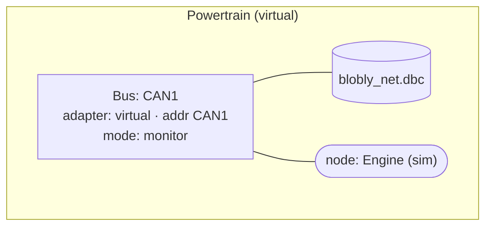
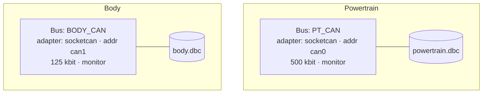
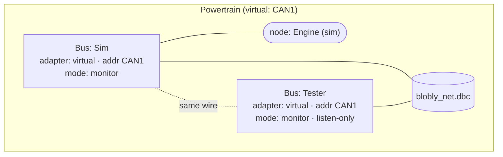
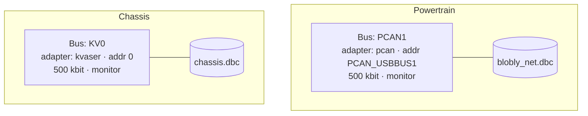
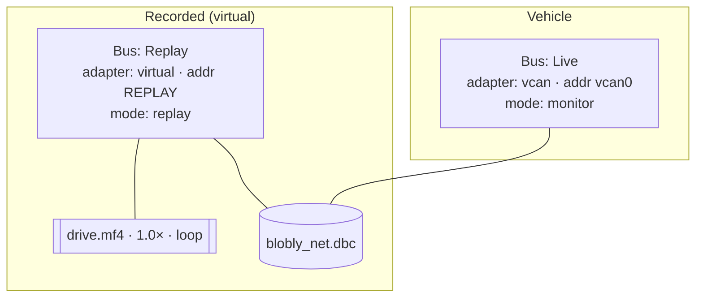
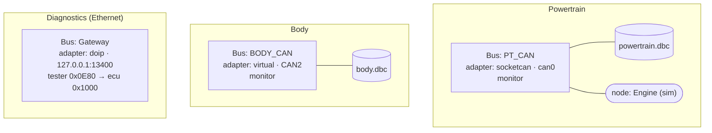
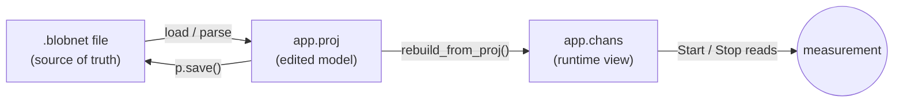

# Project editing — build a `.blobnet` from a blank project in the GUI

Status: **IMPLEMENTED** 2026-07-05 (schema v2 + File lifecycle + file browser + Configuration
editor + per-bus Trace, all 7 steps). Target: the Dear ImGui app `cmd/blobly_net`.

## Two tabs: Buses and File

The **Configuration** window (activity bar ▸ **Cfg**, or View ▸ Configuration, or
Buses ▸ Configure…) has two views of the same project:

- **Buses** — the structured editor: add, remove, enable, adapter, address, bitrate, DBCs,
  DoIP addresses, replay source. What the rest of this document describes.
- **File** — the `.blobnet` itself, edited as text.

The File tab exists because the structured editor covers **buses only**, while most of what a
project says has no form at all: simulated ECUs and their signal generators, response rules,
`protect:`, per-ECU `uds:`, channel-level `verify:`, and interactive senders. Without it those
are reachable only by leaving the application.

It edits the **text**, and saves the text — `to_yaml()` does not preserve comments, and a
`.blobnet` is where a bench setup explains itself to the next person. Round-tripping through the
model would silently strip every comment in the file.

**What the check does and does not tell you.** The status line reads *"YAML well-formed · N
channel(s) — syntax only, not a config check"*, and that wording is deliberate: `project.parse`
rejects malformed YAML (unterminated flow collections, tab indentation) and little else. A file
with no `project:` key, an unknown key, a channel with no name or a non-numeric bitrate all parse
happily — defaulted or ignored. The channel count is shown because it is the number that reveals
an edit which quietly emptied something.

One save is refused outright: text that is well-formed but yields **no channels** over a project
that had some. That is a truncated buffer or a mangled top level, never an intended edit.

Switching to File with unsaved bus edits says so, and offers to save them first or discard them
— the two tabs edit different things (the in-memory project versus the file on disk) and merging
them silently would lose one side.

## Goal

Let a user start from nothing and, entirely in the GUI, **add buses, pick an adapter,
attach DBCs, set each bus's config, and save it to a `.blobnet` file** — then reopen it
and get the same setup back. Today the app can only *load* a project; the Bus Config panel
is read-only and the File menu has no New/Open/Save/Save As.

## Vocabulary (agreed)

Comparable tools use a three-tier model; we deliberately **merge it into one first-class entity, the
Bus**, with a lightweight `network` label for grouping. One user-facing word — **Bus** —
replaces the overloaded "channel".

| Term | Definition | Where it lives |
|------|-----------|----------------|
| **Adapter** | The transport backend — *how* frames reach the wire (the driver). The thing you pick when adding a bus. | `bus.adapter` + `bus.address` |
| **Bus** | One access point onto one wire: adapter + address + operating params (protocol, mode, bitrate, listen-only) + its databases + nodes. The first-class configured entity. | one entry in `buses:` |
| **Network** | Optional *label* grouping buses that form one logical vehicle network (for the tree/display). NOT a separate table. | `bus.network` (a string) |
| **Database (DBC)** | Describes the messages/signals of the network. Conceptually network-scoped; stored on the bus. | `bus.databases[]` |
| **Node (ECU)** | A simulated/real participant, defined by a DBC transmitter. | `bus.simulate[]` / `bus.simulation[]` |

**Is a bus a channel?** Yes — 1:1 for us. Comparable tools map a logical *network* onto a hardware
*channel*; we've never needed the indirection, so Bus = network-on-a-wire.

**Adapters offered** (the picker; `inproc` is renamed for the user, scheme string unchanged):

| UI name | `adapter` | `address` example | scheme (internal `iface`) |
|---------|-----------|-------------------|---------------------------|
| Virtual (in-process) | `virtual` | `CAN1` | `inproc:CAN1` |
| Virtual CAN (vcan) | `vcan` | `vcan0` | `vcan0` |
| SocketCAN | `socketcan` | `can0` | `can0` |
| UDP software bus | `udp` | `239.0.0.1:5000` | `udp:239.0.0.1:5000` |
| PCAN | `pcan` | `PCAN_USBBUS1` | `pcan:PCAN_USBBUS1` |
| Kvaser | `kvaser` | `0` | `kvaser:0` |
| DoIP (Ethernet diag) | `doip` | `127.0.0.1:13400` | `doip:127.0.0.1:13400` |

The transport layer is untouched: parse composes `adapter`+`address` into the existing
`iface` scheme string that `transport.open()` already consumes.

## Schema (evolved, back-compatible)

`schema_version` bumps to 2. New files use `buses:` + `adapter`/`address`/`network`; old
files (`channels:` + `interface:`) still load — the parser accepts the legacy keys and
decomposes `interface:` into `adapter`+`address`.

```yaml
project:
  name: My rig
  version: 2

buses:
  - name: CAN1
    network: Powertrain          # optional grouping label
    adapter: virtual             # virtual | vcan | socketcan | udp | pcan | kvaser | doip
    address: CAN1                # adapter-specific
    protocol: can                # can | canfd
    bitrate: 500000
    mode: monitor                # off | monitor | replay
    databases: [dbc/blobly_net.dbc]
    simulate: [Engine]
```

## Example configurations

How a range of setups look under the merged **Bus + `network` label** model. A subgraph is
a network (grouping label); buses sit inside it with their adapter, DBC, and any sim nodes.

**1 — Single virtual network (driver-free sim, like `sim-demo`)**



**2 — Two independent networks in one vehicle (each its own wire + DBC)**



**3 — One network, two buses on the same wire (monitor + hosted sim)**

The pattern the engine already supports — a sim node on one bus, a passive monitor on
another, both sharing the network's DBC.



**4 — Real hardware, cross-vendor bench (two physical adapters, two networks)**



**5 — Replay + live monitor (offline analysis alongside a real bus)**



**6 — Full mixed rig: two CAN networks + a DoIP diagnostic endpoint**

DoIP is just another adapter (Ethernet/TCP), so it's a bus with no CAN bitrate — it carries
the tester/ECU logical addresses instead.



`.blobnet` for rig #6:

```yaml
project: { name: Mixed rig, version: 2 }
buses:
  - { name: PT_CAN,   network: Powertrain,  adapter: socketcan, address: can0,
      protocol: can, bitrate: 500000, mode: monitor,
      databases: [dbc/powertrain.dbc], simulate: [Engine] }
  - { name: BODY_CAN, network: Body,        adapter: virtual,   address: CAN2,
      protocol: can, bitrate: 500000, mode: monitor,
      databases: [dbc/body.dbc] }
  - { name: Gateway,  network: Diagnostics, adapter: doip,      address: 127.0.0.1:13400,
      tester_address: 0x0E80, ecu_address: 0x1000 }
```

The **network** is purely a grouping label — buses with the same `network:` string render
under one node in the Buses tree; nothing enforces it, so the common 1 bus : 1 network case
needs no ceremony (omit `network:` and the bus stands alone).

## Data model: one file, one edited copy, one derived runtime view

No new persistence, no second source of truth:

| Name | What it is | Lifetime |
|------|-----------|----------|
| the `.blobnet` file | source of truth, on disk (YAML) | persistent |
| `app.proj` (`project.Project`) | the parsed file in RAM — **the edited model** | while a project is open |
| `app.chans` (`[]Chan`) | the live runtime view (open buses, RX threads, counters) | while measuring |



**Rule: the editor mutates `app.proj`; `app.chans` is always derived from it** (so Save
captures every edit). `load_project`'s inline derivation (`main.v:731–785`) is extracted
into a reusable `rebuild_from_proj()`.

## Editing is a dedicated, stopped-only surface

The normal measurement view is **read-only**; editing is a distinct **Configuration
editor** you open, use, and close — only when stopped (a conventional tool's measurement view vs. its
Configuration dialog).

- **Buses panel + Bus Config** = always-on read-only view; shows live state when running.
- **Configuration editor** = opened from File → Configure… (or a toolbar button), enabled
  only when `!app.running`. Add/edit/remove buses, pick adapters, attach DBCs; **Save**
  writes `.blobnet`; **Close** returns to the view. Not an always-editable inline panel.

## File lifecycle + dirty tracking

Generalize `gen_dirty` → `app.dirty`. Title/toolbar shows `name ●` while dirty.

| Item | Action |
|------|--------|
| **New** | `app.proj = Project{ name: 'untitled' }`, `proj_path = ''`, rebuild → blank (0 buses) |
| **Open…** | file browser → `load_project(path)` |
| **Save** | `proj_path == ''` → Save As; else `app.proj.save(proj_path)`, clear dirty |
| **Save As…** | file browser (save) → set `proj_path`, save |
| **Configure…** | open the Configuration editor (disabled while running) |
| Open Example ▸ / Reload / Exit | unchanged |

## File browser (in-imgui, simple)

imgui has no native dialog and WSL isn't the primary target, so we add a small
self-contained imgui browser: a modal listing `os.ls(dir)` (parent, dirs, then files),
`*.blobnet` (+ `*.yml`/`*.yaml`) filter in open mode, a filename input in save mode,
Cancel/OK. Starts in the current project's dir, else `projects/`. May need two thin
`vgui.modal_begin/end` glue wrappers (a glue change ⇒ rebuild with `DEPS=1`).

## Configuration editor — the Bus fields

Per bus (a collapsing header `CAN1 · Powertrain` with **Remove**):

| Field | Widget | Notes |
|-------|--------|-------|
| name | `input_text` | |
| network | `input_text` | optional grouping label |
| adapter | toggle row (the picker above) | drives address hint + which fields show |
| address | `input_text` + per-adapter hint | `CAN1` / `vcan0` / `can0` / `grp:port` / `PCAN_USBBUS1` / `host:port` |
| protocol | toggle `can | canfd` | CAN adapters only |
| enabled | `checkbox` | |
| mode | toggle `off | monitor | replay` | CAN only |
| bitrate, data_bitrate | int input | data_bitrate only for canfd; hidden for doip |
| listen_only | `checkbox` | CAN only |
| **DBCs** | list + Remove each + **＋ Add DBC** (browser, `*.dbc`) | `bus.databases` |
| manifest | `input_text` + **…** | telemetry CSV |
| DoIP: tester/ecu addr, vin, eid | `input_text` | doip adapter only |
| Replay: source / speed / loop | inputs | mode==replay only |

Panel: **＋ Add bus** (append default `virtual` bus), **Save**, **● modified**. Nodes and
senders stay owned by the Simulation and Generators panels (all edit the same `app.proj`,
so one Save writes everything). Enum pickers use toggle-button rows — no `combo` widget
needed for the first cut.

## Trace: per-bus / per-network view

Today the Trace merges all buses into one view with a `ch` column; the only way to narrow
to a bus is typing its name into the substring filter (`trace_pass`, `main.v:1565`, matches
id/name/**ch**/dir/data). There is no first-class "watch this bus" control, which is
awkward for the common multi-bus case (e.g. a 2-vcan ECU restbus — you want vcan0 and vcan1
separable). Since the config now defines the bus/network list, the Trace reads it directly.

**Bus chips.** A row at the top of the Trace panel, one toggle-chip per configured bus, plus
**All**:

```
show:  [All]  [CAN0 · vcan0]  [CAN1 · vcan1]        (grouped under network headers when set)
```

Clicking a chip restricts the view to that bus; **All** clears. Backed by a selection set on
`App` (`trace_bus string` — `''` = all; or a `map[string]bool` for multi-select). Fold it
into `trace_pass` as a structured predicate (match on `r.ch == bus`) *before* the text
filter, so the two compose (pick a bus, then still text-search within it).

**Bindable second panel.** The existing "Trace (filter)" panel gains its own bus binding
(`ftrace_bus`), so you can have `Trace → vcan0` and `Trace (filter) → vcan1` open side by
side — the natural 2-vcan layout — independent of the frame-ID watch list it already has.

**Grouped by network.** When buses carry a `network:` label, the chip row groups them under
network headings, and the grouped trace view can show a network/bus header row. Optional
polish; the per-bus chips are the core.

No new vgui widget — chips are `toggle_button`s (already used by Generators). The chip list
is derived from `app.chans` (which comes from `app.proj`), so adding a bus in the editor
makes a new chip appear automatically.

## Blank-project walkthrough (acceptance test)

1. **File → New** → 0 buses; title `untitled ●`.
2. **Configure… → ＋ Add bus** → name `CAN1`, network `Powertrain`, adapter Virtual,
   address `CAN1`, mode monitor.
3. **＋ Add DBC** → browser → `dbc/blobly_net.dbc`.
4. **Save As** → `projects/myrig.blobnet`.
5. **New**, then **Open** `myrig.blobnet` → identical setup (round-trip).
6. **Close editor → Start** → CAN1 attaches, DBC decodes live.

## Verification

- **Round-trip unit test** (`modules/project/save_test.v`): build a `Project` from blank
  (a virtual bus + DBC, a doip bus, a replay bus, a `network` label), `to_yaml()` →
  `parse()` → assert equality. Also a legacy-file test (`channels:`/`interface:` still
  loads). Covers persistence independent of the GUI.
- **GUI smoke** (headless `VGUI_FRAMES` + `VGUI_SHOT`): seed the editor buffers, drive
  New → add bus → add DBC → Save As to a temp path, assert `project.load()` on the written
  file yields the expected bus. Click-through screenshot-verified on Windows (input works).

## Implementation plan

Ordered so each step builds + runs on its own. Model/persistence first (pure V, testable),
then the GUI surfaces. All GUI work is in the single-file `cmd/blobly_net/main.v`.

### Step 1 — schema v2 in `modules/project` (pure V, no GUI)
- `project.v`: add `Channel` fields `adapter string`, `address string`, `network string`,
  `protocol string` (`can`/`canfd`; supersedes `type` for CAN, `type: doip` still sets the
  doip adapter). Keep `iface` as the **derived internal** field.
- `parse_channel`: accept both new and legacy keys — top-level `buses:` **or** `channels:`;
  per-entry `adapter`+`address` **or** legacy `interface:`. When `adapter`/`address` are
  given, compose `iface` from them (`compose_iface(adapter, address)`); when only
  `interface:` is given, keep it and back-fill `adapter`/`address` (`decompose_iface`).
  Map `type: doip` → `adapter: doip`.
- `save.v` `to_yaml`: emit v2 — `buses:` with `adapter`/`address`/`network`/`protocol`;
  bump the written `version` to 2. (Old readers already warn on a newer version via
  `is_supported`/`version_note`.)
- `compose_iface`/`decompose_iface` helpers (adapter+address ↔ scheme string) using the
  table in this doc; unit-tested both directions.
- Tests (`save_test.v`, `project_test.v`): from-blank round-trip (virtual + doip + replay
  buses, a `network:` label); a legacy-file test (`channels:`/`interface:`/`type:` still
  loads and decomposes correctly). **Gate: `v test modules/project/` green.**

### Step 2 — `rebuild_from_proj()` extraction (`main.v`)
- Extract the derivation loop currently inline in `load_project` (`main.v:731–785`) — the
  bit that builds `app.chans`/`app.dbs`/`app.sims`/`app.senders`/`gen_bufs`/manifest/`sel_id`
  from `app.proj.channels` — into `fn (mut app App) rebuild_from_proj()`.
- `load_project` becomes: `stop → reset → app.proj = project.load(path) → rebuild_from_proj()`.
- No behaviour change. **Gate: build + `sim-demo` runs as before (screenshot).**

### Step 3 — File lifecycle + dirty flag (`main.v`)
- Rename/generalize `gen_dirty` → `dirty` (config or generator edits set it).
- File menu (`draw_menubar`, `main.v:1023`): add **New**, **Open…**, **Save**, **Save As…**,
  **Configure…** (Configure disabled while `app.running`). Keep Open Example/Reload/Exit.
- `new_project()` (`app.proj = Project{name:'untitled'}`, `proj_path=''`, rebuild),
  `save_project()` (generalized `save_generators`, `main.v:2059`; `proj_path==''` → Save As).
- Title/toolbar (`draw_toolbar`, `main.v:1108`) shows `name ●` when dirty.
- **Gate: New → 0 buses; Save on a loaded project rewrites the file byte-for-byte-ish
  (round-trips through parse).**

### Step 4 — imgui file browser (`main.v` + tiny vgui glue)
- Add `vgui.modal_begin(title) bool` / `vgui.modal_end()` (imgui `OpenPopup`+`BeginPopupModal`)
  to `libs/vgui/{vgui.v,vgui.h,vgui_glue.cpp}` — the only C change (⇒ `DEPS=1` rebuild).
- `App` state: `fb_open bool`, `fb_mode` (open|save), `fb_dir string`, `fb_name_buf []u8`,
  `fb_target` (which action runs on OK). `draw_filebrowser(mut app)`: `os.ls(dir)` → parent,
  dirs, files; `*.blobnet`/`*.yml`/`*.yaml` filter in open mode; filename input in save mode;
  Cancel/OK. Wire Open…/Save As…/＋Add DBC/manifest browse through it.
- **Gate: Open… navigates + loads a project; Save As… writes to a chosen path.**

### Step 5 — Configuration editor (`main.v`)
- `draw_config(mut app)` — a dedicated window (`show_config`, opened by Configure…), rendered
  only when stopped; while running show "Stop to edit". Replaces the read-only
  `draw_busconfig` as the *edit* surface (keep `draw_busconfig` as the running-view read-only
  panel).
- Per-bus editors per the Bus-fields table (name/network/adapter-toggle/address/protocol/
  mode/bitrate/listen_only/enabled, DBC list + ＋Add DBC via browser, manifest, DoIP fields,
  replay block). Each edit mutates `app.proj.channels[i]`, sets `dirty`, calls
  `rebuild_from_proj()`. **＋ Add bus** appends a default virtual bus; **Remove** deletes.
  **Save** = `save_project()`.
- Per-bus edit buffers (parallel arrays, like `gen_bufs`) rebuilt on load/add/remove.
- **Gate: the blank-project walkthrough (New→Add bus→Add DBC→Save As→reopen) works end to
  end; screenshot.**

### Step 6 — Trace per-bus/network view (`main.v`)
- `App`: `trace_bus string` (main Trace) + `ftrace_bus string` (second panel); `''` = all.
- Bus chips row in `draw_trace`/`draw_ftrace` (toggle_buttons from `app.chans`, **All** +
  one per bus, grouped by `network:` when set).
- `trace_pass` gains a `bus` param: `if bus != '' && r.ch != bus { return false }` before the
  text match. Grouped view optionally shows a network/bus header.
- **Gate: on the 2-vcan restbus demo, `Trace → vcan0` and `Trace (filter) → vcan1` show
  disjoint traffic.**

### Step 7 — demo + docs
- Ship a `projects/restbus-2vcan.blobnet` (two vcan buses, a DBC + simulated transmitters
  each, a request/response rule on vcan0) as the worked example.
- Update `docs/` + the status log; note the `DEPS=1`-on-glue-change gotcha in `run_gui.sh`.

### Verification summary
- `v test modules/project/` (round-trip + legacy) — Step 1.
- Headless GUI smoke (`VGUI_FRAMES`+`VGUI_SHOT`, seeded buffers) driving New→add bus→add
  DBC→Save As, asserting `project.load()` on the output — Steps 3–5.
- Manual/screenshot: blank walkthrough + 2-vcan trace split — Steps 5–6.

## Open questions (proposals)

1. **New** starts blank (0 buses, professional) — proposal: blank; the walkthrough adds one.
2. File-browser default dir — proposal: current project's dir, else `projects/`.
3. **Recent projects** list — proposal: defer (not needed for blank→save).
4. Trace bus selection single-select (`trace_bus string`) vs multi-select
   (`map[string]bool`) — proposal: single-select + **All** (simplest; two panels cover the
   2-bus case).
